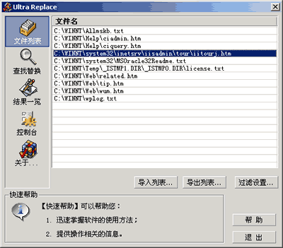

# Ultra Replace

Ultra Replace 是一款多文件文本查找/替换工具。

这款工具使用 Visual C++ 6 在 2001 年 3 月开发，使用了 Visual SourceSafe 进行版本控制。使用了 MFC 以及 BOOST 中的 RegularExpress Parser 等辅助库。

主要技术特点是：

+ 可以批量处理多个文件
+ 针对大文件做了分片处理优化
+ 循环使用内存进行查找处理，提高速度且不占用过多内存
+ 根据当时硬件条件，磁盘 IO 采用 50K 固定缓冲，提高了一定的 IO 效率
+ 界面使用了 Subclass Window 技术实现自定义绘制
+ 支持文件、文件夹拖放，支持快捷方式

相对于当时的其它文件查找/替换工具，性能有1-2个数量级的提升。
